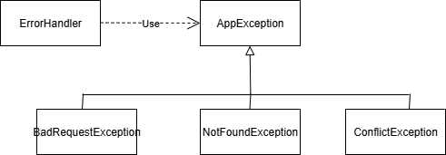
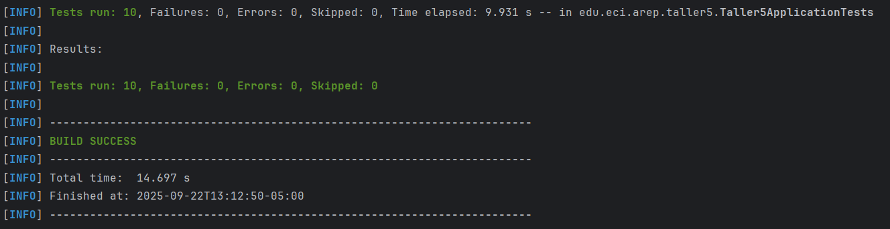

## Taller5_AREP – Sistema de Gestión de Propiedades

### Introducción
Este proyecto es una aplicación REST de gestión de propiedades construida con Spring Boot. Ofrece operaciones CRUD (crear, leer, actualizar y eliminar) y soporta filtrado y paginación por dirección, precio mínimo y tamaño mínimo. Un frontend mínimo se sirve como recursos estáticos para interactuar con el backend, mientras que la persistencia se realiza en una base de datos MySQL.

Características clave:
- Crear, actualizar, eliminar y consultar propiedades
- Paginación y filtros opcionales: dirección, precio y tamaño 
- Validación de DTO con manejo de errores claro
- Servicio contenedorizado listo para despliegue en la nube

### Arquitectura del Sistema
El sistema sigue una arquitectura clásica de tres capas: un frontend estático, un backend en Spring Boot y una base de datos MySQL. El frontend realiza peticiones HTTP al backend, el cual persiste datos en MySQL vía JPA.


- Puerto del backend: `8080` (ver `application.properties` y `Dockerfile`).
- Base de datos: `3306` MySQL 8.
- Conexión a BD vía variables de entorno: `SPRING_DATASOURCE_URL`, `MYSQL_USER`, `MYSQL_PASSWORD` ó con
H2 para pruebas locales.

Formato de ejemplo para `SPRING_DATASOURCE_URL`:
- Local/MySQL: `jdbc:mysql://<host>:3306/<database>?useSSL=false&serverTimezone=UTC`

### Diseño de Clases
Dominio y capas principales:


Archivos relevantes:
- `src/main/java/edu/eci/arep/taller5/model/Property.java`: Entidad JPA para propiedades.
- `src/main/java/edu/eci/arep/taller5/model/DTO/PropertyDTO.java`: DTO para validación de entrada.
- `src/main/java/edu/eci/arep/taller5/repository/PropertyRepository.java`: Repositorio Spring Data JPA con consulta de filtro.
- `src/main/java/edu/eci/arep/taller5/service/PropertyService.java` y `.../Imp/PropertyServiceImp.java`: Lógica de negocio.
- `src/main/java/edu/eci/arep/taller5/controller/PropertyController.java`: Endpoints REST.

Adicionalmente, se implementó un middleware que gestiona las excepciones y construye la respuesta HTTP con el
código de error correspondiente.



### Resumen de la API REST
Ruta base: `/properties`

- GET `/properties`
  - Parámetros de consulta (opcionales): `location`, `price`, `sizeProperty`, y los de Spring `page`, `size`
  - Retorna `Page<Property>`

- GET `/properties/{id}` → `Property`

- POST `/properties` → crea `Property` a partir de `PropertyDTO`

- PUT `/properties/{id}` → actualiza una `Property` existente

- DELETE `/properties/{id}` → elimina la propiedad

Ejemplos de uso:
```bash
# Listar la primera página de propiedades
curl -s "http://localhost:8080/properties?page=0&size=10"

# Filtrar por ubicación que contenga 'park', precio >= 100000, tamaño >= 50
curl -s "http://localhost:8080/properties?location=park&price=100000&sizeProperty=50"

# Crear
curl -s -X POST "http://localhost:8080/properties" \
  -H "Content-Type: application/json" \
  -d '{"address":"742 Evergreen Terrace","price":350000,"size":120,"description":"Family home"}'

# Actualizar
curl -s -X PUT "http://localhost:8080/properties/1" \
  -H "Content-Type: application/json" \
  -d '{"address":"Updated","price":360000,"size":125,"description":"Updated desc"}'

# Eliminar
curl -s -X DELETE "http://localhost:8080/properties/1" -i
```

### Desarrollo Local
Prerequisitos: Java 21, Maven 3.9+, MySQL 8 (o una instancia MySQL alojada).

1) Conexión a la base de datos
   - Configura variables de entorno (ejemplo):
    ```bash
    set SPRING_DATASOURCE_URL=jdbc:mysql://localhost:3306/properties?useSSL=false&serverTimezone=UTC
    set MYSQL_USER=root
    set MYSQL_PASSWORD=secret
    ```
    luego en el `application.properties`
    ```properties
    spring.datasource.url=${SPRING_DATASOURCE_URL}
    spring.datasource.username=${MYSQL_USER}
    spring.datasource.password=${MYSQL_PASSWORD}
    spring.jpa.hibernate.ddl-auto=update
    spring.jpa.properties.hibernate.dialect=org.hibernate.dialect.MySQL8Dialect
    server.port=8080
    spring.datasource.driver-class-name=com.mysql.cj.jdbc.Driver
    spring.jpa.open-in-view=false
    ```
   - Ó usa H2 colocando lo siguiente en el `application.properties`

    ```bash
    spring.datasource.url=jdbc:h2:mem:arep;DB_CLOSE_DELAY=-1;DB_CLOSE_ON_EXIT=FALSE;MODE=MySQL
    spring.datasource.driverClassName=org.h2.Driver
    spring.datasource.username=sa
    spring.datasource.password=password
    spring.jpa.database-platform=org.hibernate.dialect.H2Dialect
    spring.jpa.defer-datasource-initialization=true
    spring.h2.console.enabled=true
    spring.h2.console.path=/h2-console
    spring.h2.console.settings.web-allow-others=false
    ```
   Luego abre `http://localhost:8080/h2-console` e inicia sesión con las credenciales.

2) Construye el JAR:
```bash
mvn clean install
```

3) Ejecuta localmente:
```bash
java -jar target/taller5-0.0.1-SNAPSHOT.jar
```

El frontend estático se sirve desde `src/main/resources/static` en `http://localhost:8080/`.

### Contenerización e Imágenes
El `Dockerfile` (base Java 21) construye una imagen de ejecución para el JAR de Spring Boot.

Construcción y ejecución local:
```bash
# Build jar
mvn clean install

# Build image
docker build -t taller5-arep .

# Ejecutar contenedor (conectando a MySQL local)
docker run --rm -p 8080:8080 \
  -e SPRING_DATASOURCE_URL="jdbc:mysql://host.docker.internal:3306/properties?useSSL=false&serverTimezone=UTC" \
  -e MYSQL_USER="root" \
  -e MYSQL_PASSWORD="secret" \
  --name taller5 taller5-arep:latest
```

Opcional: ejecutar con un MySQL acompañante usando Docker Compose (fragmento de ejemplo):
```yaml
version: "3.8"
services:
  db:
    image: mysql:8.0
    environment:
      MYSQL_DATABASE: properties
      MYSQL_ROOT_PASSWORD: secret
    ports:
      - "3306:3306"
  app:
    image: taller5-arep:latest
    depends_on:
      - db
    environment:
      SPRING_DATASOURCE_URL: jdbc:mysql://db:3306/properties?useSSL=false&serverTimezone=UTC
      MYSQL_USER: root
      MYSQL_PASSWORD: secret
    ports:
      - "8080:8080"
```

### Despliegue en AWS 
Este trabajo despliega la aplicación Spring Boot anteriormente implementada y una base de datos MySQL en dos instancias **EC2** separadas dentro del mismo **VPC**. La comunicación entre servicios ocurre por IP privada y se protege con **Security Groups**.

Prerequisitos:
- Cuenta de AWS, AWS CLI configurada
- Docker Hub
- Instancias EC2 

Pasos:
1) Construir y subir la imagen a un repositorio en Docker Hub
```bash
#Construir imagen docker 
docker build -t tallercincoarep . 
#Enlazar el repositorio en Docker HUB a la imágen
docker tag tallercincoarep camilatorres0812/taller5
#Subir la imagen al repositorio
docker push camilatorres0812/taller5:latest
```

2) Aprovisionar infraestructura
- Crear una instancia EC2 para la aplicación.
- Configurar reglas de entrada para que permita escuchar por el puerto `8080`
- Crear otra instancia EC2 para la base de datos
- Configurar la misma VPC y Subred de la instancia de la EC2 de la aplicación
- Crear reglas de entradas para que escuche la red privada de la EC2 de la aplicación por el puerto `3306`

3) Crear contenedores docker en las instancias
- Instalar docker

```bash
#Descargar docker
sudo yum install docker
#Iniciar servidor Docker
sudo service docker start
#Dar permisos
sudo usermod -a -G docker ec2-user
```
- Crear contenedor docker en la instancia EC2 de la Base de Datos
```bash
#Crear volumen 
docker volume create mysql_data
#Crear el contenedor MYSQL
docker run -d \
  --name mysql \
  --restart unless-stopped \
  -p 3306:3306 \
  -v mysql_data:/var/lib/mysql \
  -e MYSQL_ROOT_PASSWORD="<CLASE_DEL_ROOT>" \
  -e MYSQL_DATABASE="<NOMBRE_BD>" \
  -e MYSQL_USER="<NOMBRE_USUARIO>" \
  -e MYSQL_PASSWORD="<CONTRASEÑA_USUARIO>" \
  mysql:8
```

- Crear contenedor docker en la instancia EC2 de la aplicación

```bash
#Crear el contenedor Docker con el repositorio de Docker hub
docker run -d \
  --name taller5 \
  --restart unless-stopped \
  -p 8080:8080 \
  -e SPRING_DATASOURCE_URL="jdbc:mysql://<IP_PRIVADA_DB>:3306/taller5?useSSL=false&allowPublicKeyRetrieval=true&serverTimezone=UTC" \
  -e SPRING_DATASOURCE_USERNAME="<NOMBRE_USUARIO>" \
  -e SPRING_DATASOURCE_PASSWORD="<CONTRASEÑA_USUARIO>" \
  camilatorres0812/taller5:latest
```
Se debe colocar la IP privada, usuario y contraseña creados en la EC2 de la base de datos. 

5) Verificar el despliegue

```bash
http://<alb-dns-or-service-public-ip>:8080
```

#### Video despliegue


### Pruebas

#### Pruebas manuales

1. Pruebas en la interfáz

2. Pruebas con Postman

#### Prueba automáticas
Se incluye pruebas con JUnit y Mockito para validar el funcionamiento del framework.
Las pruebas de unidad y de contexto están en `src/test/java/...`.

Ejecutar todas las pruebas:
```bash
mvn test
```
#### Verificación

Este proyecto incluye un conjunto completo de pruebas unitarias que garantizan el correcto funcionamiento de todas las operaciones CRUD del sistema de propiedades.

##### Cobertura de Pruebas

* Operaciones Cubiertas

  - CREATE - Creación de propiedades
  - READ - Obtención de propiedades por ID y paginadas con filtros
  - UPDATE - Actualización de propiedades existentes
  - DELETE - Eliminación de propiedades

* Casos de Prueba

  - Casos exitosos 
  - Manejo de errores y excepciones
  - Validaciones de entrada
  - Consistencia de datos



## Tecnologías utilizadas

* [Java 21](https://openjdk.org/projects/jdk/21/) - Lenguaje de Programación
* [Maven](https://maven.apache.org/) - Compilaciones y dependencias
* [JUnit](https://junit.org/) - Framework de testeo
* [Spring Data JPA](https://spring.io/projects/spring-data-jpa) - Capa de acceso a datos
* [MySQL](https://www.mysql.com/) - Moto de base de datos 
* [Docker](https://www.docker.com/) - Plataforma de contenedores para empaquetado y despliegue 
* [AWS](https://aws.amazon.com/) - Plataforma cloud 

## Autores

* **Andrea Camila Torres González**

## Licencia

Este proyecto no cuenta actualmente con una licencia específica.  
Su uso está restringido únicamente a fines académicos.